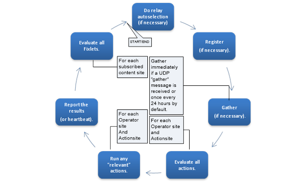

# The elegance of the BigFix client loop

The BigFix Agent is the soul of BigFix and what makes BigFix attractively unique. The agent supports over 70 operating system platforms ([see the list here](https://www.hcl-software.com/bigfix/supported-software)) today, and a vast majority of that code is shared across the various agent platforms. The agent is where the intelligence of the platform is distributed. A key differentiator of BigFix is the operational scale that it can (and does) support today (300,000 endpoints is no small feat). The key attribute that enables this scale is the deviation from the typical client/server management architecture. The typical design is the server component scales to work on behalf of the number of clients. In BigFix, the client works to decide what work to do. Meaning, the client is the owner of decisions, not the server. The agent evaluates the machine in near real-time for content, not the server. The intention here is to align the workload to a place where resources are added as the workload increases. As additional machines are managed by a BigFix architecture, those machines align their own resources to service their own workload. Having the client evaluate if it is applicable to an instruction means per machine BigFix scales evaluation resources to the number of clients versus the resources on a central server/machine.

The BigFix Agent decision process resides within what is referred to as the “client loop”. My deep appreciation of the elegance that is BigFix started with gaining an understanding of how the client loop operates. The intention of this blog is to provide a general technical understanding of the client loop. I will attempt to itemize some factors that influence its performance, in hopes that this context will help drive the most value out of BigFix within your environment. 

## Definition of client loop

The BigFix Agent basically has a large `while {…}` loop that processes Fixlets, reports heartbeats, and constantly evaluates the state of the machine. The BigFix Agent is designed to use only a small fraction of the computer's CPU (< 1-2%) on average by default. The 2% characteristic is controlled within the confines of a work/sleep cycle. This allows the BigFix Agent to minimize the impact to the user experience. The client by default will work 10ms and sleep (idle) every 480ms. This equates on average to the <1-2% CPU utilization mentioned above. The average time to finish an evaluation loop on a standard ~2 GHz computer is 5-15 minutes in a healthy environment. This is heavily dependent upon a few variables, but mainly upon the amount of content (Fixlets, analysis, actions, baselines, etc.) being evaluated. As more actions/Fixlets are published the `while` loop will gradually take longer. With lots of actions/Fixlets/etc., it could take up to 30-60 minutes or more. The real-time feel of BigFix is directly related to the efficiency of the client loop. 

---

### Illustration of Client Loop Activities

  

 
During the 10ms of the 490ms the client is permitted to work, the client performs tasks like processing Fixlets, reporting heartbeats, and evaluating the state of the machine. The longest phases within the loop occur during the evaluation of content and actions. The amount of content and actions heavily impacts the time the loop will take to complete. The time taken directly correlates to the time the Agent may take to observe a change within the system and report or remediate. The performance of the client loop should always be considered heavily and respected. The client loop is ultimately the largest contributing factor to the real-time visibility of BigFix.

---

## BES Relay auto selection (if necessary)

Relay selection is the process by which a client chooses its relay. Relay selection occurs only if the BES Relay auto selection time expires or an event triggers relay selection. The concept of relay selection is another elegant component of how BigFix works, and in itself deserves its own blog. However, to keep things on point, I’ll just touch upon this subject briefly. 

### Events Triggering Relay Selection

- Change of IP address
- Client can no longer report to its selected relay
- The ‘Relay Select’ action command is executed
- Local time changes backwards by more than 5 minutes

**Note**: There are additional events with some nuance.

### Events NOT Triggering Relay Selection

- Restart of the BigFix Agent service
- Endpoint reboot
- Gathering a new copy of Relays.dat
- Change in client affiliation seeklist setting 

---

## Client registration (if necessary)

The first thing the BES Agent does after installation is attempt to register with the BES Server. The registration event’s main purpose is to inform the BES Server where the client is located within the infrastructure so it can be notified (via 52311 UDP by default) if required. Registration is the first thing that occurs when the client starts up. If the BigFix Agent cannot register, it will not report its status or receive notices to gather. However, the client will still evaluate content within its loop and notify the infrastructure of any changes in status upon connecting. If the BigFix Agent cannot register it will try to register continually every few minutes.

---

## Gather (if necessary)

If the BigFix Agent registers properly, it will then gather all the content that it requires.

### List of Sites the Agent Attempts to Gather

- **ActionSite**: The first site gathered by the BigFix Agent, owned by master operators. Known as the “Rails” of BigFix.
- **Content Sites**: Content sites for which the agent is subscribed.
- **Operator Sites**: Sites of operators who manage the client.

The BigFix Agent will gather a site any time it receives a UDP “gather” message. The BigFix Agent will only request the delta of information that has changed since the last time it gathered the site. If the BigFix Agent’s version of the site is too old, it will gather the full site.

---

## Evaluate all Open Actions / Run Relevant Actions / Report Results

After gathering all the content, the BigFix Agent evaluates all the actions for each operator that manages the client. The BigFix Agent then reports the results through the relay hierarchy to the BES Server, and this is ultimately reflected in the console. If there are any actions targeted to, and relevant to the BigFix Agent, the BigFix Agent will run the actions and report the results. 

> **Note**: Initializing the action portion of the instruction is not subject to the work/sleep idle cycle (2% governor). This phase uses a separate set of settings for the work/sleep cycle.

Each operator is represented with an operator site, which contains any actions or content that the operator may have published. The creation of an action does not stop the original content from being evaluated. Instead, both the original content and action are evaluated.

**Performance Consideration**: If 5 operators take action upon 5 Microsoft Windows patches on machines they share, the client will evaluate each action within each operator’s site and the original content, equating to 25 actions (5 checks per operator, 5 sites to check), adding 400% overhead.

---

## Evaluate All Fixlets

The BigFix Agent gathers all content from content sites to which it subscribes. For instance, if a machine subscribes to the Patches for Windows (English) site (containing 18378 Fixlets), each Fixlet will be evaluated for applicability. This evaluation of each relevant statement within all Fixlets affects the performance of the loop.

**Performance Consideration**: The amount of Fixlets individually evaluated affects loop performance. More subscribed content sites result in longer loop completion times.

---

## In Conclusion

The client loop is the strength of BigFix, though it needs to be understood to optimize any BigFix infrastructure. The client has a workload of content, which typically grows over time, but the agent has limited resources (CPU) allocated by default through work/sleep idle settings. Optimizing the workload (content and actions) and potentially increasing available resources (configurable) are key to maintaining performance.

---

## Things You Can Do to Protect Your Client Loop

- **Limit Open Actions**: Only keep necessary actions open; delete stopped and expired actions regularly.
- **Minimize Baselines**: Baselines add overhead and should be minimized. Use small baselines rather than a single large baseline.
- **Minimize Duplicative Actions**: Avoid overlap from multiple operators taking the same action on the same machine.
- **Minimize Number of Operators**: Limit the number of operators in the environment.
- **Judicious Operator Scope**: Scope operator machine access carefully to reduce evaluation workload.
- **Subscribe Content Selectively**: Only subscribe machines to sites that contain relevant content.
- **Optimize Client Relevance**: Efficiently structure relevance statements to minimize performance impact. Using the client profiler can help identify potential issues ([learn more about the client profiler here](https://bigfix-wiki.hcltechsw.com/wikis/home?lang=en-us#!/wiki/BigFix%20Wiki/page/Slow%20and%20Unresponsive%20Clients%20-%20Troubleshooting)).
